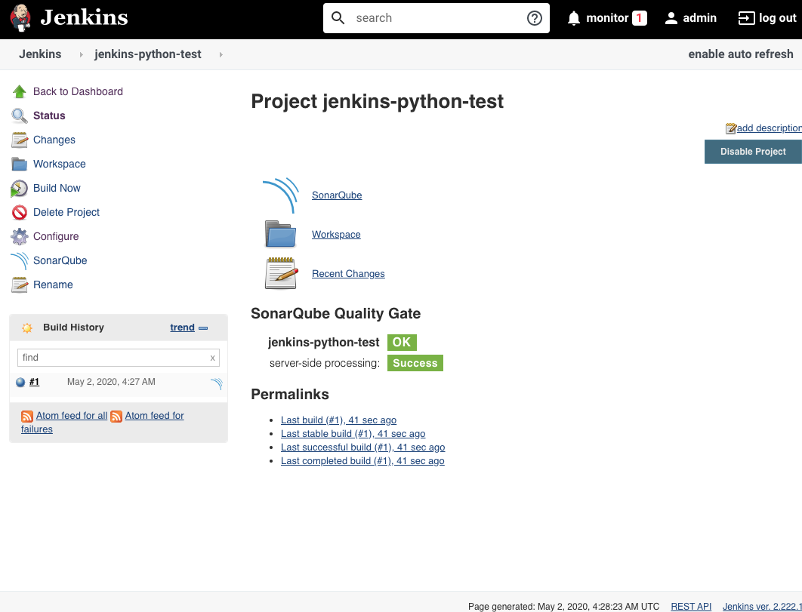
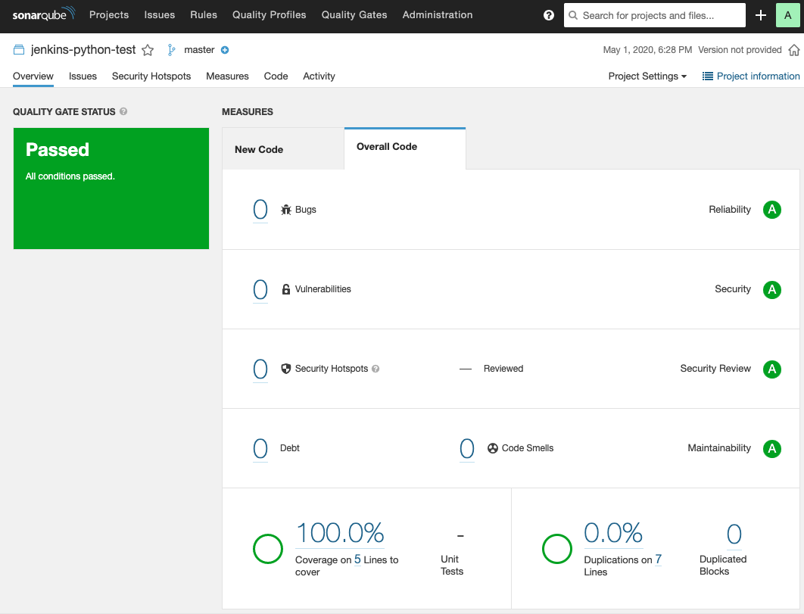

Jenkins and SonarQube
=====================

This project demonstrates how to setup and run Jenkins with SonarQube using
official Docker containers on localhost.

Prerequisites:

* Docker 19+
* Docker Compose 2+

To build Docker images, execute this command:

```
docker-compose build
```

To setup directories from volume mounts, execute this command:

```
./setup.sh
```

To run, execute this command:

```
docker-compose up
```

or to run as daemon:

```
docker-compose up -d
```

Setup
=====

Jenkins Setup
-------------

1. Open Jenkins in a web browser to `http://localhost:8080/`.
2. On first run, Jenkins will ask for an admin password. Password can be found with:

```
cat ./jenkins/secrets/initialAdminPassword 
```

3. During the setup wizard, choose `Install suggested plugins`.
4. For this demonstration, click `Continue as Admin`.
5. For this demonstration, click `Save and Finish`.
6. Click `Start using Jenkins`.


Install SonarScanner for Jenkins
--------------------------------

1. Open Jenkins in a web browser to `http://localhost:8080/`.
2. Click on `Manage Jenkins` link.
3. Click on `Manage Plugins` link.
4. Click on `Available` tab.
5. Select `SonarQube Scanner` checkbox.
6. Click `Install without restart` button.
7. Click `Go back to the top page` link after installation is complete.
8. Click `Manage Jenkins` link.
9. Click `Configure System` link.
10. Click `Enable injection of SonarQube server configuration as build environment variables` checkbox.
11. Click `Add SonarQube` button.
12. Set `Name` to `SonarQube Server` and `Server URL` to `http://sonarqube:9000`.
13. Click `Save` button.
14. Click on `Manage Jenkins` link.
15. Click `Global Tool Configuration` link.
16. Click `Add SonarQube Scanner` under `SonarQube Scanner`.
17. Set `Name` to `SonarQube Server`.
18. Click `Save` button.


SonarQube Setup
---------------

1. Open SonarQube in a web browser to `http://localhost:9000/`.
2. Login with user: `admin`, password: `admin`.
3. Click `Adminstration` link.
4. Click `Marketplace` link.
5. For this demo you will need to install `SonarPython`, `SonarJS`, `SonarHTML`, `SonarCSS`, `Java Code Quality and Security`, `Git`, `JaCoCo`.
6. Click `Restart Server` button.


Python Example
==============

SonarQube Project Setup
-----------------------

1. Open SonarQube in a web browser to `http://localhost:9000/`.
2. Login with user: `admin`, password: `admin`.
3. Click `+` and select `Create new project` link.
4. Set `Project key` to `jenkins-python-test`.
5. Click `Set Up` button.
6. Set token name to `jenkins-token`.
7. Click `Generate` button.
8. Copy token and store somewhere. Token will be needed later.
9. Click `Continue` button.
10. Click `Other` button.
11. Click `Linux` button.
12. Copy `sonar-scanner` code and store somewhere secure.


Jenkins Project Setup
---------------------

1. Open Jenkins in a web browser to `http://localhost:8080/`.
2. Click `New Item` link.
3. Fill in `Enter an item name` with `jenkins-python-test`.
4. Click `Freesytle project`.
5. Click `OK` button.
6. Click `Git` for Source Code Management.
7. Enter `https://github.com/Algoritics/jenkins-python-test.git`.
8. Click `Build` -> `Add build step` button.
9. Select `Execute shell`.
10. Enter `make coverage` in `Command` textbox.
11. Click `Build` -> `Add build step` button.
12. Select `Execute SonarQube Scanner`.
13. Enter `sonar-project.properties` in `Path to project properties` textbox.
14. Enter project key and login in `Analysis properties` textbox (replace login with generated sonar token). Example:

```
sonar.projectKey=jenkins-python-test
sonar.login=ba7a9af4518eea0acb77a6b7fc19ea01a13d2f7e
```

15. Click `Save` button.
16. Click `Build now` button to verify working.
17. On success, Jenkins will display `OK` and SonarQube will display `Passed`.






Java/Maven Example
==================

SonarQube Project Setup
-----------------------

1. Open SonarQube in a web browser to `http://localhost:9000/`.
2. Login with user: `admin`, password: `admin`.
3. Click `+` then select `Create new project` link.
4. Set `Project key` to `jenkins-maven-test`.
5. Click `Set Up` button.
6. Select `Use existing token`.
7. Paste your token into the textbox.
8. Click `Continue` button.
9. Click `Java` button.
10. Click `Maven` button.
11. Copy `mvn sonar:sonar` code and store somewhere secure.


Install SonarScanner for Jenkins
--------------------------------

1. Open Jenkins in a web browser to `http://localhost:8080/`.
2. Click on `Manage Jenkins` link.
3. Click on `Manage Plugins` link.
4. Click on `Available` tab.
5. Select `Maven Integration` and `Maven SNAPSHOT Check` checkbox.
6. Click `Install without restart` button.
7. Click `Go back to the top page` link after installation is complete.
8. Click on `Manage Jenkins` link.
9. Click on `Global Tool Configuration` link.
10. Click on `Add Maven` button.
11. Set `Name` to `Maven`.
12. Set `MAVEN_HOME` to `/usr/share/maven`.


Jenkins Project Setup
---------------------

1. Open Jenkins in a web browser to `http://localhost:8080/`.
2. Click `New Item` link.
3. Fill in `Enter an item name` with `jenkins-maven-test`.
4. Click `Maven project`.
5. Click `OK` button.
6. Click `Git` for Source Code Management.
7. Enter `https://github.com/Algoritics/jenkins-maven-test.git`.
8. Fill `Build` -> `Goals and option` with `clean install`.
9. Click `Add post-build step`.
10. Select `Execute SonarQube Scanner`.
11. Fill `Path to project properties` with `sonar-project.properties`.
12. Enter project key and login in `Analysis properties` textbox (replace login with generated sonar token). Example:

```
sonar.projectKey=jenkins-maven-test
sonar.login=ba7a9af4518eea0acb77a6b7fc19ea01a13d2f7e
```

13. Click `Save` button.
14. Click `Build Now` button to verify working.


Troubleshooting
===============

* If SonarQube exits with `Process exited with exit value [es]: 137`, increase available memory to Docker (recommend >4GB).
* To delete containers and volumes, run:

```
docker-compose down
./clean.sh
```
